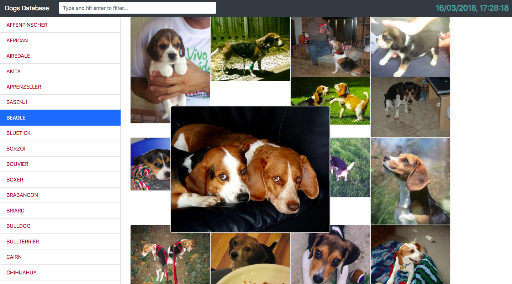

# NgrxDogs

Angular 5, NgRx 4 and Bootstrap 4 Dog Database using the open dogs api (api available at https://dog.ceo/dog-api/)

## Screenshots

## How to run

`npm i` , `ng serve` to install all dependencies and run the dev server. Navigate to `http://localhost:4200/`. 

